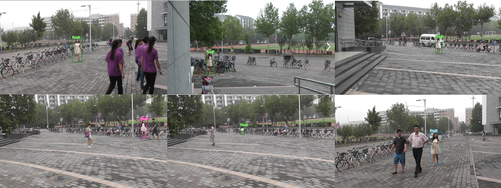

person search
===============

<div align="center">



<p> 对特定行人进行检索演示 .</p>
</div>

:trophy: 利用YOLOv3结合行人重识别模型实现场景图片的特定行人检索

文章链接: https://zhuanlan.zhihu.com/p/82398949

代码使用小教程：https://blog.csdn.net/songwsx/article/details/101693665

------

:running: Getting Started
-----

## :one: Clone the repo:

```
git clone https://github.com/songwsx/person_search_demo
```
-----

## :two: Dependencies

Tested under python3.6  Ubantu16.04

- python packages
  - opencv-python
  - tb-nightly
  - torch >= 1.0

---------

## :three: 权重文件下载
YOLO是直接采用原来的权重文件，并且还支持YOLO-spp.
行人重识别采用了Market1501、CUHK03和MSMT17三个数据集大概十七万张图片进行联合训练的，泛化性能更好。
训练好的模型已经上传到了群文件中，欢迎加群下载，一起交流

百度云链接：
链接：https://pan.baidu.com/s/16kyogSsGwL2VgMkNSn9-zg 
提取码：f0g9 

####  :point_right: 云深不知处-目标检测 763679865

下载完成后，将权重文件放在新建的**person_search_demo/weights**文件夹下即可

-----

:four: 进行测试，查找特定行人
--------

```
python search.py
```

结果将保存在output文件夹

速度在Ttian XP测试，大概有17 FPS

## :five: 进行训练

行人检测模型采用的是YOLOv3的代码，因此可以直接利用原[YOLO](https://link.zhihu.com/?target=https%3A//github.com/ultralytics/yolov3)的代码进行训练，得到权重文件。

行人重识别模型采用的是[strong reid baseline](https://link.zhihu.com/?target=https%3A//github.com/michuanhaohao/reid-strong-baseline)的模型，不过为了取得更好的泛化效果，可以多数据集联合训练，得到最终权重文件。

